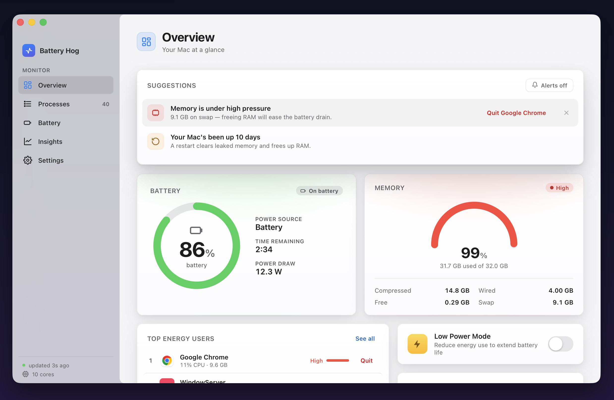
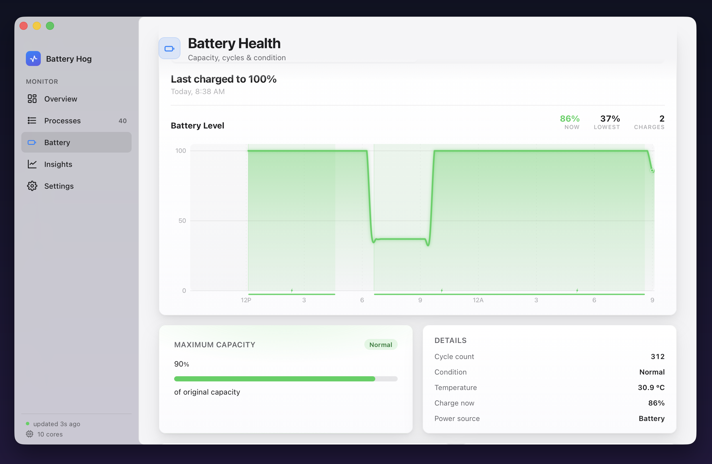
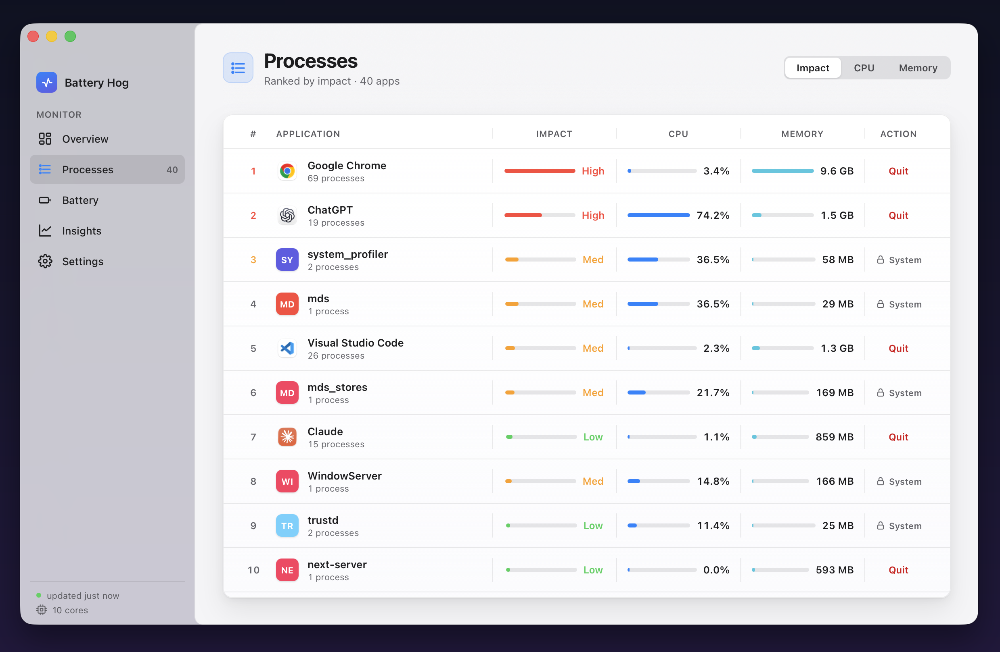

<div align="center">
  <h1>Battery Hog</h1>
  <p><b>A native macOS app that shows what's draining your battery — and actually helps you fix it.</b></p>
</div>



Battery Hog is a small, fast, **100% local** menu-bar + window app for Apple Silicon Macs. It shows live battery, memory, and per-app energy use, keeps a real charge history, estimates *why* your battery drains fast, and lets you quit the worst offenders — all read straight from built-in macOS tools, with nothing sent anywhere.

No Electron, no dependencies: a tiny Swift/WebKit shell around a Python standard-library backend and an HTML/CSS dashboard.

## Download

**[⬇︎ Download the latest .dmg →](https://github.com/luke-fairbanks/BatteryHog/releases/latest)** — open it and drag **Battery Hog** to Applications. Builds are signed and notarized, so it opens like any other app. (Prefer to build it yourself? See [Install](#install).)

Or with Homebrew:

```bash
brew install --cask luke-fairbanks/tap/battery-hog
```

Requires macOS 11+ on Apple Silicon.

## Features

- **Overview** — battery ring (state-colored), **live power draw in watts**, memory-pressure gauge, top energy users with real app icons, and a Low Power Mode toggle.
- **Processes** — sortable list (Impact / CPU / Memory) of apps grouped by process, with a Quit button. System processes are protected; the header stays pinned while rows scroll.
- **Battery** — a **charge-history chart** (Last 24 Hours / Last 10 Days, built from the system power log) plus maximum capacity, condition, cycle count, and temperature.
- **Insights** — answers *"why does my battery drain so fast?"*: typical drain rate (%/hr), projected runtime per charge, time on battery, charge sessions, and overnight wake-ups.
- **Smart suggestions** — contextual, actionable tips (restart after long uptime, free RAM under pressure, plug in when low, unplug at 100%, …). Mute tips for apps you can't quit.
- **Opt-in alerts** — native notifications for low battery, full charge, and runaway-CPU apps.
- **Configurable menu bar** — choose what the status item shows: battery %, watts, time remaining, and/or the top app.

<p align="center"></p>

<p align="center"></p>

## Install

Requires macOS on Apple Silicon and the Xcode command-line tools (`xcode-select --install`).

```bash
git clone https://github.com/luke-fairbanks/BatteryHog.git
cd BatteryHog
bash src/build.sh        # builds "Battery Hog.app" and installs it to /Applications
```

Then launch **Battery Hog** from Spotlight or Launchpad.

### Optional: password-free Low Power Mode

Toggling Low Power Mode and reading detailed energy normally prompt for your admin
password. To skip that, run the included helper once — it installs a **tightly-scoped**
`sudoers` rule that lets *only* two exact commands run without a password (and nothing else):

```bash
sudo bash src/enable-no-password.sh      # undo: sudo rm /etc/sudoers.d/battery-hog
```

Everything else in the app works without it.

## Building a signed, notarized release

`src/build.sh` makes an **unsigned** local build (fine for yourself, but Gatekeeper warns
on first launch). To produce a notarized `.dmg` that opens with no warning, you need an
Apple Developer Program membership and a *Developer ID Application* certificate, then:

```bash
# one-time: save notarization credentials
xcrun notarytool store-credentials BatteryHog-notary \
  --apple-id "you@example.com" --team-id "TEAMID" --password "app-specific-password"

# build → sign (hardened runtime) → notarize → staple → package
SIGN_ID="Developer ID Application: Your Name (TEAMID)" bash src/release.sh
```

This outputs `dist/BatteryHog-<version>.dmg`, stapled and ready to share. Attach it to a
GitHub Release:

```bash
gh release create v1.0 dist/BatteryHog-1.0.dmg --title "Battery Hog 1.0"
```

> The app uses no third-party libraries, so it needs no special hardened-runtime
> entitlements — `src/release.sh` signs it with `--options runtime` and nothing else.

## How it works

The backend reads only built-in macOS tools and exposes them on `127.0.0.1`:

| Data | Source |
|---|---|
| Battery %, state, time | `pmset` |
| Live watts, health, cycles, temp | `ioreg` (AppleSmartBattery), `system_profiler` |
| Charge history + wake events | `pmset -g log` |
| Memory pressure / swap | `vm_stat`, `sysctl` |
| Per-app CPU / memory | `ps` |
| Uptime | `sysctl kern.boottime` |

The Swift shell (`src/BatteryHogApp.swift`) hosts the dashboard in a `WKWebView` with a
translucent sidebar, serves real app icons, and runs the menu-bar item.

## Privacy

100% local. Battery Hog reads only from the macOS tools above and shows the results in its
own window. **Nothing is sent anywhere** — no network requests, no analytics. The admin
password (if you use Low Power Mode) goes straight to macOS's own prompt.

## License

[MIT](LICENSE) © Luke Fairbanks
